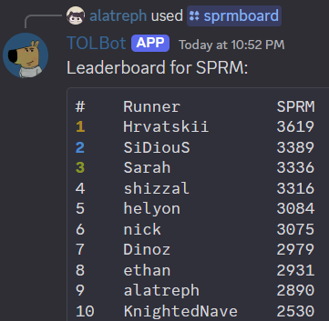

# ThatOtherLeaderboard4

An alternative leaderboard for Portal speedrunning. Accessed through discord, it mirrors [speedrun.com](https://speedrun.com/Portal) to stay up-to-date, but also tracks runs that haven't been submitted to the official leaderboards.

*TOL (left) tracks runs that aren't on the official boards (right)*

TOL also tracks other things, such as gold splits for each user, split times for runs, and user peripheral information.

This data opens up a world of additional functionality.

*Comparisons like this are incredibly helpful when looking for places to improve!*

A number of interesting statistics and secondary rankings are also available.

In addition to the time and world ranking (WR) of a player's personal bests, TOL tracks:
- The continental ranking (CR)
- The national ranking (NR)
- A custom evaluation metric (SPRM)

It also tracks for each player:
- Their average rank
- The sum of their personal bests (AMC Summary)
- Their overall SPRM

For each of those metrics, there is also a leaderboard players can compete on.

